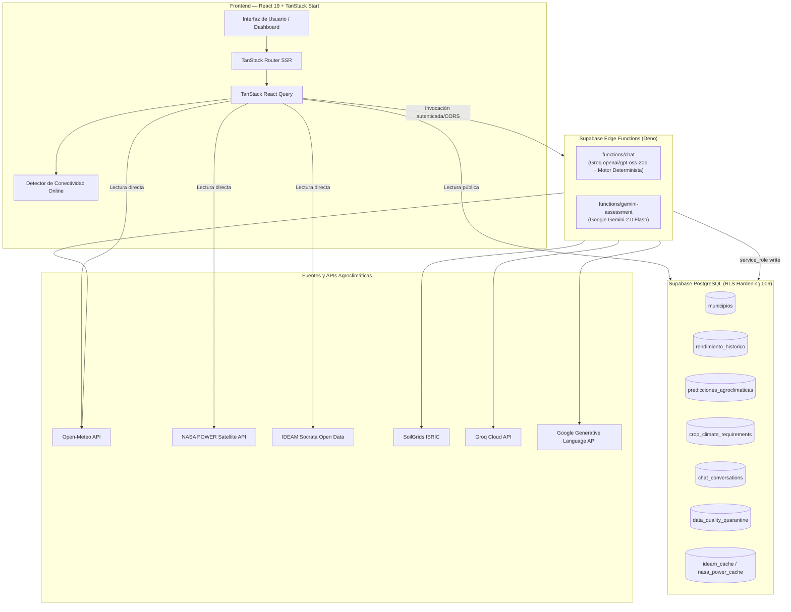

# SembraData: Predicción Agroclimática — Santander

> **SembraData** es una plataforma web interactiva de analítica agroclimática predictiva diseñada para mitigar los riesgos climáticos y optimizar la toma de decisiones agrícolas en el **departamento de Santander, Colombia**. Cubre con precisión técnica los **87 municipios del departamento**, enfocándose en cultivos estratégicos (**Cacao, Café y Granadilla**), con observaciones climáticas en tiempo real, perfiles de suelo por profundidad, series históricas verificadas (EVA / MinAgricultura), pronósticos estadísticos reproducibles (Theil-Sen) y un asistente conversacional trazable libre de alucinaciones.

 

---

## Despliegue de la Aplicación

> [!IMPORTANT]
> La versión de producción se encuentra desplegada y conectada a Supabase. Toda la información geográfica y agroclimática está delimitada a los 87 municipios de Santander.

### [Abrir SembraData en Producción](https://231-sembradata-abierto-ia-avanzado.vercel.app/)

**`https://231-sembradata-abierto-ia-avanzado.vercel.app/`**

### [Sustentación y Documentación Ejecutiva](https://gamma.app/docs/Prediccion-Agroclimatica-Inteligente-vr0vp5qbfomjv4y)

---

## Características Principales

| Icono | Módulo / Característica                     | Descripción Técnica                                                                                                                                                                                                                                                                          |
| :---: | :------------------------------------------ | :------------------------------------------------------------------------------------------------------------------------------------------------------------------------------------------------------------------------------------------------------------------------------------------- |
|  🗺️   | **Mapa Coroplético de Santander**           | Visualización vectorial SVG de los **87 municipios** con selector geográfico y clasificación por zonas agroecológicas y niveles de riesgo.                                                                                                                                                   |
|  📈   | **Histórico vs. Predicción**                | Series históricas observadas de **EVA / MinAgricultura** contrastadas con proyecciones estadísticas del motor **Theil-Sen / Rolling Origin** con intervalos de predicción al 80% y 95% ($L_{80}, U_{80}, L_{95}, U_{95}$). **0 datos sintéticos** (requiere $N \ge 3$ observaciones reales). |
|  🤖   | **Chatbot Agroclimático Trazable**          | Asistente inteligente respaldado por servicios deterministas del servidor, validación geográfica contra el catálogo de Santander, RAG con umbral de relevancia $\ge 3.0$, modelo Groq (`openai/gpt-oss-20b`) y sanitizador anti-alucinaciones con acordeón de afirmaciones verificadas.      |
|  🧪   | **Evaluación Agronómica Gemini**            | Edge Function (`gemini-assessment`) con **Google Gemini 2.0 Flash** para emitir evaluación cualitativa de consistencia biológica sin alterar los valores numéricos del modelo estadístico.                                                                                                   |
|  ⛅   | **Clima en Vivo (Open-Meteo)**              | Monitoreo meteorológico en tiempo real, pronóstico a 7 días y balance hídrico sin requerir claves de API expuestas.                                                                                                                                                                          |
|  🛰️   | **Validación Satelital (NASA POWER)**       | Radiación solar, evapotranspiración de referencia y variables agroclimáticas históricas.                                                                                                                                                                                                     |
|  📡   | **Estaciones IDEAM**                        | Integración con datos abiertos de estaciones meteorológicas oficiales del IDEAM vía Socrata (datos.gov.co).                                                                                                                                                                                  |
|  🪨   | **Propiedades del Suelo (SoilGrids ISRIC)** | Perfiles pedológicos por profundidad (pH en $H_2O$, materia orgánica, textura, arena/arcilla/limo).                                                                                                                                                                                          |
|  📊   | **Mercado Internacional y Nacional**        | Cotizaciones de referencia internacional (ICE Cocoa CC / Coffee KC) y nacional (DANE SIPSA Centroabastos) con estrategia _Stale-While-Revalidate_ y análisis de presión climática.                                                                                                           |
|  🛡️   | **Arquitectura Conectada Segura**           | Aplicación estrictamente conectada con indicador de red en tiempo real, políticas RLS (Migración 009), dataset EVA 2018–2024 (Migración 010), tabla de cuarentena de calidad de datos y frontend de solo lectura.                                                                            |

---

## Arquitectura de Sistemas

---

