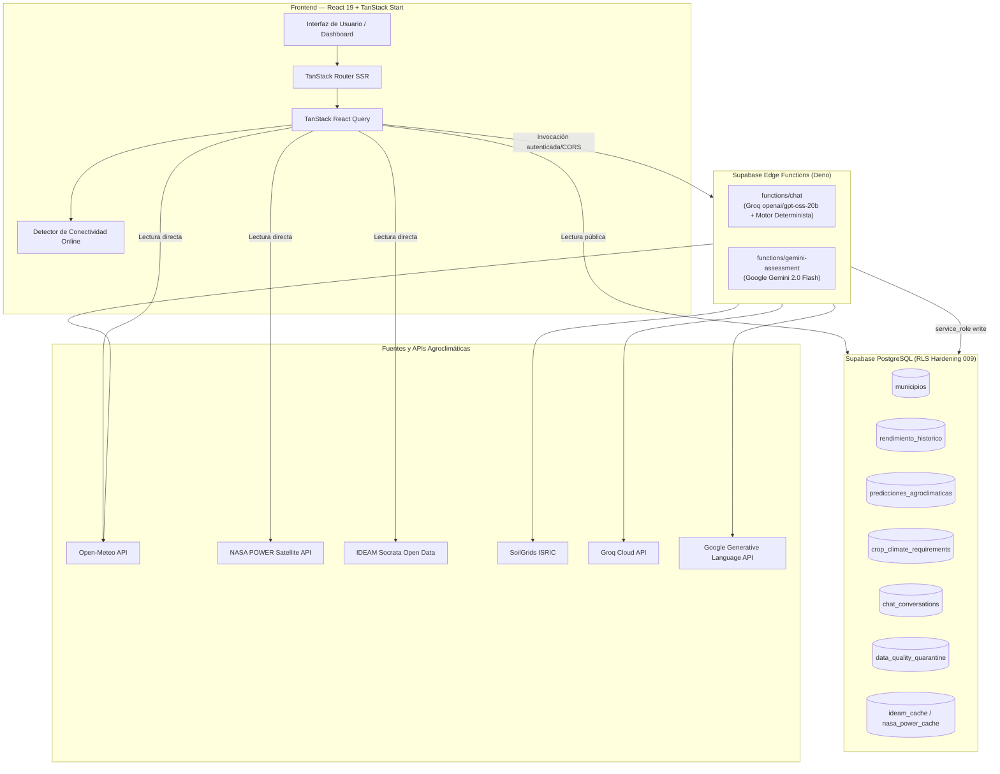

<div align="center">

# SembraData: Predicción Agroclimática — Santander

> **SembraData** es una plataforma web interactiva de analítica agroclimática predictiva diseñada para mitigar los riesgos climáticos y optimizar la toma de decisiones agrícolas en el **departamento de Santander, Colombia**. Cubre con precisión técnica los **87 municipios del departamento**, enfocándose en cultivos estratégicos (**Cacao, Café y Granadilla**), con observaciones climáticas en tiempo real, perfiles de suelo por profundidad, series históricas verificadas (EVA / MinAgricultura), pronósticos estadísticos reproducibles (Theil-Sen) y un asistente conversacional trazable libre de alucinaciones.

<br/>


</div>

---

## Despliegue de la Aplicación

> [!IMPORTANT]
> La versión de producción se encuentra desplegada y conectada a Supabase. Toda la información geográfica y agroclimática está delimitada a los 87 municipios de Santander.

<div align="center">

### [Abrir SembraData en Producción](https://231-sembradata-abierto-ia-avanzado.vercel.app/)

**`https://231-sembradata-abierto-ia-avanzado.vercel.app/`**

### [Sustentación y Documentación Ejecutiva](https://gamma.app/docs/Prediccion-Agroclimatica-Inteligente-vr0vp5qbfomjv4y)

</div>

---

## Características Principales

| Icono | Módulo / Característica                     | Descripción Técnica                                                                                                                                                                                                                                                                          |
| :---: | :------------------------------------------ | :------------------------------------------------------------------------------------------------------------------------------------------------------------------------------------------------------------------------------------------------------------------------------------------- |
|  🗺️   | **Mapa Coroplético de Santander**           | Visualización vectorial SVG de los **87 municipios** con selector geográfico y clasificación por zonas agroecológicas y niveles de riesgo.                                                                                                                                                   |
|  📈   | **Histórico vs. Predicción**                | Series históricas observadas de **EVA / MinAgricultura** contrastadas con proyecciones estadísticas del motor **Theil-Sen / Rolling Origin** con intervalos de predicción al 80% y 95% ($L_{80}, U_{80}, L_{95}, U_{95}$). **0 datos sintéticos** (requiere $N \ge 3$ observaciones reales). |
|  🤖   | **Chatbot Agroclimático Trazable**          | Asistente inteligente respaldado por servicios deterministas del servidor, validación geográfica contra el catálogo de Santander, RAG con umbral de relevancia $\ge 3.0$, modelo Groq (`openai/gpt-oss-20b`) y sanitizador anti-alucinaciones con acordeón de afirmaciones verificadas.      |
|  🧪   | **Evaluación Agronómica Gemini**            | Edge Function (`gemini-assessment`) con **Google Gemini 2.0 Flash** para emitir evaluación cualitativa de consistencia biológica sin alterar los valores numéricos del modelo estadístico.                                                                                                   |
|  ⛅   | **Clima en Vivo (Open-Meteo)**              | Monitoreo meteorológico en tiempo real, pronóstico a 7 días y balance hídrico sin requerir claves de API expuestas.                                                                                                                                                                          |
|  🛰️   | **Validación Satelital (NASA POWER)**       | Radiación solar, evapotranspiración de referencia y variables agroclimáticas históricas.                                                                                                                                                                                                     |
|  📡   | **Estaciones IDEAM**                        | Integración con datos abiertos de estaciones meteorológicas oficiales del IDEAM vía Socrata (datos.gov.co).                                                                                                                                                                                  |
|  🪨   | **Propiedades del Suelo (SoilGrids ISRIC)** | Perfiles pedológicos por profundidad (pH en $H_2O$, materia orgánica, textura, arena/arcilla/limo).                                                                                                                                                                                          |
|  🛡️   | **Arquitectura Conectada Segura**           | Aplicación estrictamente conectada con indicador de red en tiempo real, políticas RLS (Migración 009), tabla de cuarentena de calidad de datos y frontend de solo lectura.                                                                                                                   |

---

## Arquitectura de Sistemas



---

## Tabla de Variables de Entorno y Secretos

| Variable                 | Ámbito / Entorno            | Propósito                                  | Tipo / Visibilidad            | Ejemplo Seguro                   |
| :----------------------- | :-------------------------- | :----------------------------------------- | :---------------------------- | :------------------------------- |
| `VITE_SUPABASE_URL`      | Frontend / Runtime Web      | URL del proyecto Supabase PostgREST        | Pública (compilada en bundle) | `https://xyzproject.supabase.co` |
| `VITE_SUPABASE_ANON_KEY` | Frontend / Runtime Web      | Clave pública anónima de Supabase con RLS  | Pública (compilada en bundle) | `eyJhbGciOiJIUzI1Ni...`          |
| `VITE_IDEAM_APP_TOKEN`   | Frontend (Opcional)         | Token de datos abiertos de Socrata (IDEAM) | Pública                       | `xAppTokenExample123`            |
| `VITE_SENTRY_DSN`        | Frontend (Opcional)         | DSN de monitoreo de errores en Sentry      | Pública                       | `https://public@sentry.io/123`   |
| `GROQ_API_KEY`           | **Supabase Edge Functions** | Clave de autenticación para Groq Cloud     | **Secreto Server-Side**       | `gsk_********************`       |
| `GEMINI_API_KEY`         | **Supabase Edge Functions** | Clave de Google AI Gemini 2.0 Flash        | **Secreto Server-Side**       | `AIzaSy******************`       |
| `ALLOWED_ORIGINS`        | **Supabase Edge Functions** | Orígenes CORS autorizados adicionales      | Secreto Server-Side           | `https://sembradata.com`         |

> [!CAUTION]
> **Regla de Seguridad:** Las variables `GROQ_API_KEY` y `GEMINI_API_KEY` son de uso **exclusivo server-side** en Supabase Edge Functions. **Nunca deben exponerse en archivos `.env` del frontend, en el build de Docker ni en repositorios Git.**

---

## Configuración de Secretos en Supabase CLI

Para configurar los secretos de forma segura en las Edge Functions:

```bash
# Iniciar sesión en la CLI de Supabase
npx supabase login

# Configurar claves de servidor sin versionarlas en el código
npx supabase secrets set GROQ_API_KEY="<tu_groq_api_key>" --project-ref <tu_project_ref>
npx supabase secrets set GEMINI_API_KEY="<tu_gemini_api_key>" --project-ref <tu_project_ref>
```

---

## Inicio Rápido y Desarrollo Local

### Requisitos Previos

- **Node.js**: `v22.x` (LTS recomendada)
- **npm**: `v10.x` o superior

### Instalación y Ejecución

```bash
# 1. Clonar el repositorio
git clone https://github.com/Jd1278/231-sembradata-abierto-ia-avanzado.git
cd 231-sembradata-abierto-ia-avanzado

# 2. Instalar dependencias exactas
npm ci

# 3. Configurar variables de entorno locales en .env
cp .env.example .env

# 4. Iniciar servidor de desarrollo
npm run dev
```

La aplicación estará disponible en `http://localhost:5173`.

---

## Construcción y Ejecución con Docker

SembraData incluye un `Dockerfile` multi-stage optimizado con Node 22 Alpine, usuario no privilegiado (`node`) y servidor SSR Nitro.

```bash
# 1. Construir la imagen de producción
docker build \
  --build-arg VITE_SUPABASE_URL="https://hhnbaxwbeywyriigcwav.supabase.co" \
  --build-arg VITE_SUPABASE_ANON_KEY="tu_anon_key" \
  -t sembradata-web:latest .

# 2. Ejecutar el contenedor de producción
docker run -d \
  -p 3000:3000 \
  --name sembradata-app \
  sembradata-web:latest

# 3. Comprobar salud del contenedor
docker ps
wget -qO- http://localhost:3000/
```

---

## Despliegue de Edge Functions

```bash
# Desplegar chatbot con Groq y motor determinista
npx supabase functions deploy chat --project-ref <project-ref> --no-verify-jwt

# Desplegar evaluador cualitativo Gemini
npx supabase functions deploy gemini-assessment --project-ref <project-ref> --no-verify-jwt
```

---

## Pipeline de Calidad y Validación

Ejecución de la suite completa de pruebas, verificación de tipos y compilación:

```bash
npm run validate
```

El pipeline ejecuta secuencialmente:

1. `npm run typecheck` (`tsc --noEmit`): Validación de tipos TypeScript estrictos.
2. `npm run lint` (`eslint .`): Reglas de estilo y calidad de código.
3. `npm run test` (`vitest run`): 51 archivos de prueba y 392 pruebas unitarias/integración.
4. `npm run build` (`vite build`): Compilación para producción en formato Nitro SSR.
