# Arquitectura de Sistemas — SembraData

Documentación técnica de la arquitectura full-stack, flujo de datos, seguridad y servicios de SembraData.

---

## 1. Diagrama de Componentes del Sistema

```mermaid
flowchart TD
    subgraph CapaFrontend["1. Capa Frontend (React 19 + TanStack Start SSR)"]
        Dashboard[Dashboard / Mapa Coroplético 87 Municipios]
        PredPanel[Panel de Viabilidad y Pronóstico]
        HistValidation[Gráfico Histórico vs. Predicción]
        ChatbotUI[Panel de Chatbot Asistente con Acordeón de Claims]
        NetWatcher[Detector de Red Online Obligatorio]
    end

    subgraph CapaSSR["2. Capa Servidor Nitro (node-server)"]
        NitroServer[Nitro SSR Engine en Node 22 Alpine]
        StaticAssets[Static Assets y Chunks Optimizados]
    end

    subgraph CapaEdge["3. Capa de Servicios Serverless (Supabase Edge Functions en Deno)"]
        ChatEdge["Edge Function: chat\n(Groq openai/gpt-oss-20b + Motor Determinista + RAG)"]
        GeminiEdge["Edge Function: gemini-assessment\n(Google Gemini 2.0 Flash)"]
    end

    subgraph CapaPersistencia["4. Capa de Persistencia y Seguridad (Supabase PostgreSQL)"]
        MuniCat[(municipios: 87 Santander)]
        EvaHist[(rendimiento_historico: EVA MinAgr)]
        PredVers[(predicciones_agroclimaticas: Theil-Sen)]
        Requirements[(crop_climate_requirements)]
        Conversations[(chat_conversations: service_role)]
        Quarantine[(data_quality_quarantine)]
        CacheStore[(ideam_cache / nasa_power_cache)]
    end

    subgraph CapaAPIs["5. Fuentes Agroclimáticas Externas (Directas / Gateway)"]
        OpenMeteo[Open-Meteo API: Clima en tiempo real y 7d]
        SoilGrids[SoilGrids ISRIC: Pedología por profundidades]
        NasaPower[NASA POWER: Radiación solar y evapotranspiración]
        IdeamSocrata[IDEAM datos.gov.co: Estaciones meteorológicas]
        GroqCloud[Groq Cloud: Inferencia ultra-rápida]
        GoogleAI[Google Generative Language: Gemini AI]
    end

    Dashboard --> NitroServer
    NitroServer --> CapaFrontend
    Dashboard & PredPanel & HistValidation --> NetWatcher
    Dashboard --> OpenMeteo & SoilGrids & NasaPower & IdeamSocrata
    HistValidation -->|Lectura pública| EvaHist & PredVers
    PredPanel -->|Invocación| GeminiEdge
    ChatbotUI -->|Invocación CORS segura| ChatEdge
    ChatEdge -->|service_role write/read| MuniCat & EvaHist & PredVers & Requirements & Conversations
    ChatEdge --> GroqCloud & OpenMeteo & SoilGrids
    GeminiEdge --> GoogleAI
```

---

## 2. Flujo de Datos y Trazabilidad

1. **Selección Territorial:** El usuario selecciona un municipio de Santander en el mapa SVG. Se resuelven coordenadas oficiales, altitud y zona agroecológica desde la tabla `municipios`.
2. **Ingesta Agroclimática en Vivo:**
   - **Clima:** Open-Meteo provee temperatura actual, humedad, viento y acumulado de lluvia a 7 días.
   - **Suelo:** SoilGrids ISRIC suministra pH en $H_2O$, materia orgánica y textura.
   - **Satélite / Estaciones:** NASA POWER e IDEAM complementan radiación solar y observaciones históricas.
3. **Cálculo de Viabilidad Bioclimática:** El motor del cliente evalúa la adecuación fisiológica de Café, Cacao o Granadilla frente a los umbrales institucionales de Cenicafé / Fedecacao / AGROSAVIA.
4. **Histórico vs. Predicción:**
   - **Observaciones Reales:** Se consultan los registros históricos de EVA / MinAgricultura en `rendimiento_historico`.
   - **Motor Estadístico (Theil-Sen):** Si existen $N \ge 3$ observaciones reales, se calculan proyecciones estadísticas e intervalos de confianza al 80% y 95% ($L_{80}, U_{80}, L_{95}, U_{95}$). Si $N < 3$, el sistema declara explícitamente `status: "insufficient_data"` (**0 datos sintéticos**).
   - **Evaluación Gemini:** La Edge Function `gemini-assessment` evalúa cualitativamente la consistencia biológica sin alterar los valores estadísticos.
5. **Asistente Conversacional Trazable:**
   - El usuario envía una consulta a `functions/v1/chat`.
   - La función valida geográficamente el municipio en Supabase, extrae datos deterministas reales, aplica RAG técnico (umbral $\ge 3.0$) y solicita a Groq (`openai/gpt-oss-20b`) una respuesta estructurada en formato JSON Zod.
   - El verificador server-side coteja cada afirmación numérica contra el conjunto de hechos reales y neutraliza cualquier dato inventado.

---

## 3. Seguridad y Políticas RLS (Migración 009)

- **Frontend de Solo Lectura:** El cliente navegador no realiza escrituras directas ni borrados sobre tablas de caché o pronósticos.
- **Acceso Restringido:** Las tablas `chat_conversations`, `predicciones_agroclimaticas` (escritura) y `data_quality_quarantine` tienen RLS restringido a `service_role` (utilizado exclusivamente por las Edge Functions).
- **Lectura Pública:** Las tablas `municipios`, `cultivos`, `rendimiento_historico`, `crop_climate_requirements` y el `SELECT` de `predicciones_agroclimaticas` permiten lectura pública.
- **Secretos:** `GROQ_API_KEY` y `GEMINI_API_KEY` se almacenan en el almacén de secretos de Supabase y nunca se transmiten al cliente web.
- **CORS Estricto:** Validación dinámica de orígenes con rechazo **HTTP 403 Forbidden** para llamadas fuera de la allowlist.

---

## 4. Política de Conectividad Obligatoria

SembraData es una plataforma **estrictamente conectada**:

- Las predicciones, datos climáticos y recomendaciones exigen acceso en tiempo real a APIs y bases de datos actualizadas.
- Se ha eliminado por completo el Service Worker de caché funcional y los respaldos en `localStorage` / `IndexedDB` que pudieran presentar información desactualizada como si fuera actual.
- Un componente de red (`useNetworkStatus`) detecta desconexiones e informa al usuario con un banner de estado no intrusivo y opciones de reintento.
