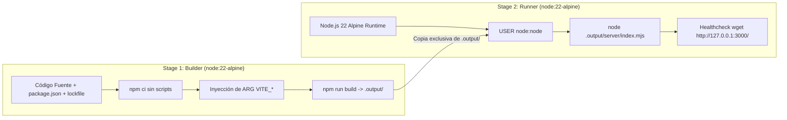

# Guía de Despliegue y Operación con Docker — SembraData

Documentación técnica para la construcción, configuración de entorno, ejecución segura y resolución de problemas de contenedores Docker en SembraData.

---

## 1. Arquitectura del Contenedor

SembraData utiliza una estrategia de compilación **Multi-Stage** sobre `node:22-alpine` para garantizar imágenes ligeras (<180 MB), reproducibles y seguras:



---

## 2. Construcción de la Imagen (`docker build`)

### Inyección de Variables Públicas en Build-Time

Vite compila las variables `VITE_*` directamente en el bundle estático del cliente. Deben pasarse como `--build-arg`:

```bash
docker build \
  --build-arg VITE_SUPABASE_URL="https://hhnbaxwbeywyriigcwav.supabase.co" \
  --build-arg VITE_SUPABASE_ANON_KEY="eyJhbGciOiJIUzI1NiIsInR5cCI6IkpXVCJ9..." \
  --build-arg VITE_IDEAM_APP_TOKEN="opcional_app_token" \
  --build-arg VITE_SENTRY_DSN="https://public@sentry.io/123" \
  -t sembradata-web:latest .
```

> [!CAUTION]
> **Seguridad de Secretos:** Nunca pases `GROQ_API_KEY`, `GEMINI_API_KEY` ni `SUPABASE_SERVICE_ROLE_KEY` en `docker build`. Esos secretos se gestionan en Supabase Edge Functions y nunca dentro del contenedor web.

---

## 3. Ejecución del Contenedor (`docker run`)

```bash
# Ejecución estándar en puerto 3000
docker run -d \
  --name sembradata \
  -p 3000:3000 \
  --restart unless-stopped \
  sembradata-web:latest

# Ver logs del servidor Nitro SSR
docker logs -f sembradata
```

---

## 4. Verificación de Salud (`Healthcheck`)

El contenedor incluye una sonda de salud integrada configurada en el Dockerfile:

- **Comando:** `wget --no-verbose --tries=1 --spider http://127.0.0.1:3000/ || exit 1`
- **Intervalo:** 30 segundos
- **Timeout:** 5 segundos
- **Start Period:** 10 segundos
- **Retries:** 3 intentos

Para verificar el estado de salud:

```bash
docker inspect --format='{{json .State.Health.Status}}' sembradata
# Retorna: "healthy"
```

---

## 5. Prevención de Fuga de Secretos (`.dockerignore`)

El archivo `.dockerignore` previene la inclusión accidental de datos sensibles o archivos innecesarios en la imagen:

- `.env`, `.env.*`, `*.pem`, `*.key`
- `node_modules/`
- `.git/`, `.gemini/`
- `tests/`, `scratch/`
- `.output/` previo del host de desarrollo (evitando binarios compilados en Windows)

---

## 6. Diagnóstico y Troubleshooting

| Síntoma                                              | Causa Posible                                                                         | Solución                                                                                                  |
| :--------------------------------------------------- | :------------------------------------------------------------------------------------ | :-------------------------------------------------------------------------------------------------------- |
| `Cannot find module '.output/server/index.mjs'`      | Falló el paso de build en el stage 1.                                                 | Revisar logs de compilación de Vite y verificar que `npm run build` corra limpio.                         |
| La aplicación muestra `Supabase credentials missing` | No se proporcionaron `VITE_SUPABASE_URL` o `VITE_SUPABASE_ANON_KEY` en `--build-arg`. | Reconstruir la imagen pasando los `--build-arg` obligatorios.                                             |
| El contenedor se reinicia por fallo de healthcheck   | El puerto 3000 no está disponible o el inicio tomó más de 10s.                        | Verificar que `NITRO_PORT=3000` y `NITRO_HOST=0.0.0.0` estén definidos.                                   |
| Error de permisos de usuario                         | Intento de escribir en el sistema de archivos como usuario `node`.                    | La aplicación opera en modo de solo lectura sobre `.output/`. Las persistencias se realizan vía Supabase. |
