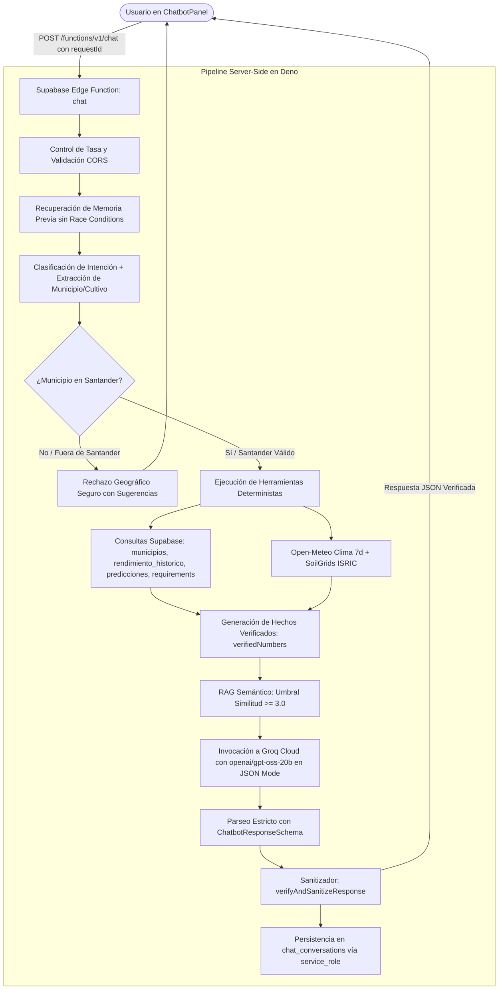

# Arquitectura del Chatbot Agroclimático — Groq (`openai/gpt-oss-20b`) + Motor Determinista + RAG

Documentación técnica del asistente inteligente conversacional trazable de SembraData.

---

## 1. Visión General de la Arquitectura

El chatbot de SembraData opera como una **Edge Function en Deno** (`supabase/functions/chat/index.ts`) bajo una arquitectura determinista orientada a la **prevención absoluta de alucinaciones** y a la **trazabilidad fáctica**:

---

## 2. Herramientas Deterministas del Servidor

La Edge Function no delega el cálculo numérico al LLM. Antes de invocar a Groq, ejecuta funciones deterministas (`deterministic.ts`):

1. `getMunicipalityProfile(municipioId)`: Coordenadas, altitud oficial en msnm y zona agroecológica desde la tabla `municipios`.
2. `getObservedYield(municipioId, cropId)`: Últimos rendimientos observados oficiales de EVA / MinAgricultura.
3. `getPrediction(municipioId, cropId)`: Pronóstico activo Theil-Sen con intervalos de confianza al 80% y 95% ($L_{80}, U_{80}, L_{95}, U_{95}$).
4. `getCropRequirements(cropId)`: Parámetros óptimos de Cenicafé / Fedecacao / AGROSAVIA.
5. `getCurrentExternalContext(lat, lng)`: Clima actual de Open-Meteo y perfil de suelo de SoilGrids.
6. `extractVerifiedNumbers(tools)`: Empaqueta todos los números válidos en una lista blanca de hechos inmutables.

---

## 3. Modelo de Inferencia y Formato Estricto

- **Proveedor:** Groq Cloud API compatible con OpenAI.
- **Modelo:** `openai/gpt-oss-20b`.
- **Formato:** Modo JSON forzado (`response_format: { type: "json_object" }`).
- **Esquema de Salida (Zod):**
  - `answer`: Respuesta redactada en lenguaje natural técnico.
  - `summary`: Resumen ejecutivo en una oración.
  - `claims`: Lista de afirmaciones estructuradas con tipo (`observed`, `forecast`, `model_estimate`, `agronomic_requirement`), fuente oficial, valor numérico, unidad y nivel de confianza.
  - `recommendations`: Acciones recomendadas sustentadas en hechos.
  - `insufficientData` / `needsHumanReview`: Banderas de calidad de datos.

---

## 4. Saneamiento Anti-Alucinaciones (`verifyAndSanitizeResponse`)

El módulo de verificación compara todas las cifras numéricas presentes en `answer`, `summary`, `claims` y `recommendations` contra `verifiedNumbers`. Si el LLM genera una cifra que no provenga del contexto determinista:

- La afirmación inventada es neutralizada a orientación general sin valor numérico.
- Se activa la bandera `insufficientData: true` y `needsHumanReview: true`.
- Se registra la discrepancia para observabilidad sin fallar la experiencia del usuario.

---

## 5. Seguridad y Persistencia

- **CORS:** Validación dinámica de orígenes con rechazo **HTTP 403 Forbidden** a llamadas ajenas a la allowlist.
- **Secretos:** `GROQ_API_KEY` reside exclusivamente en los secretos de Supabase (`supabase secrets set GROQ_API_KEY="..."`).
- **Persistencia RLS:** Las lecturas y escrituras en `chat_conversations` se realizan con `service_role` desde la Edge Function.
